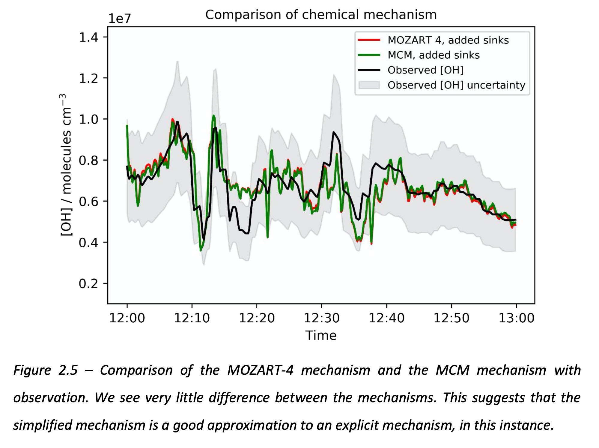
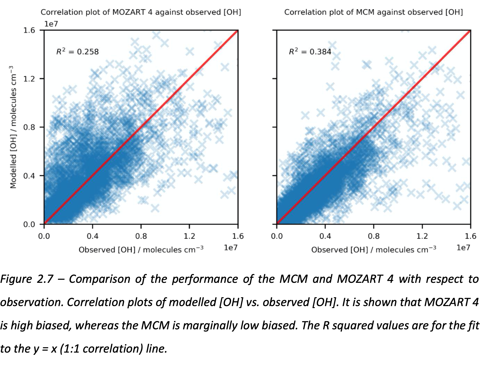

SH, and PTG, JMW, ATA in some order

## Abstract
* making use of the ATOM data to examine effect of chemical mechanisms
* making use of ATOM data to examine effect of modelling parameters
* showing that a RR method can perform similary to MCM/MOZART4

## Introduction

Atmospheric oxidizing capacity is important but hard to estimate.  

Evaluation of tropospheric OH on global scale particularly challenging: missing sources, missing sinks, partitioning.

Methods to estimate OH relies on box model approaches, e.g. Spivakovsky.  Box model with inputs of photolysis rates and sinks, performed over global range.   Uncertainties can be dominated by photochemical inputs (e.g. cloudiness, albedo)

Another approach is globally integrated assessments, e.g. MCF.  Uncertainties can be dominated by anciliary loss processes (e.g. unknown sinks for MCF).

These approaches have limitations, e.g. Prather estimate of CH4 lifetime.

ATOM provides new approach.  Targets whole troposphere.  Highly instrumented so provides sufficient constraint for photochemical model input and outputs.  

Paper uses these data together with a reduced-complexity CCM mechanism and a state-of-the-art explicit mechanism in a unified framework to examine the output of photochemical model and to compare with observations.

## Methods

## Results/Discussion

Figures?

